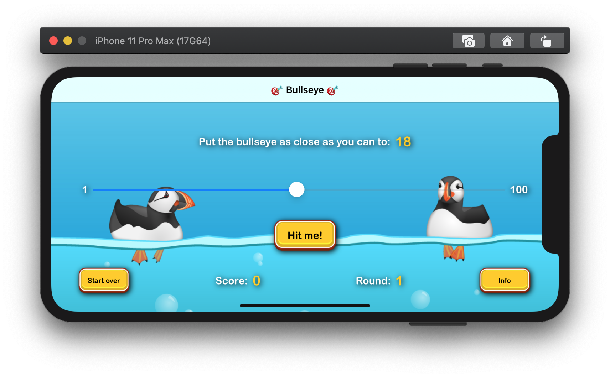

<h1 align="center">
  
    <br>
</h1>

<h4 align="center">
  Simple iOS game application created with SwitUI. This is my result after following the steps in iOS Apprentice book.
</h4>

<p align="center">


</p> 


<p align="center">
  <a href="#computer-technologies">Technologies</a>&nbsp;&nbsp;&nbsp;|&nbsp;&nbsp;&nbsp;
  <a href="#installing-the-application">How to run</a>&nbsp;&nbsp;&nbsp;|&nbsp;&nbsp;&nbsp;
  <a href="#page_facing_up-license">License</a>&nbsp;&nbsp;&nbsp;|&nbsp;&nbsp;&nbsp;
  <a href="#mailbox_with_mail-get-in-touch">Get in touch</a>
</p>
<br><br>

### :computer: Technologies

This project was developed with the following technologies:

-  [Swift](https://angular.io)
-  [SwiftUI](https://www.typescriptlang.org)

<!-- ### Installing the Application
Clone the repository and install the dependencies.
```bash
# to clone the repository
$ git clone https://github.com/Jurfest/angular9-essencial-tutorial-from-coder.git

# go into the folder
$ cd angular9-essencial-tutorial-from-coder/

#install dependencies
$ npm install

```

### :microscope: A way to inspect the code

After installing VS Code:

```bash
$ code .
```

### Running the application

```bash
$ ng serve
```
Inside the browser:
<p>http://localhost:4200</p> -->


### Preview

<h1 align="center">
    
</h1>

### Acknowledgment

This project is my result after completing the firt sesseion of the iOS Apprentice book avaliable on   [Raywenderlich website](https://www.raywenderlich.com).

### :mailbox_with_mail: Get in touch!

[LinkedIn](https://www.linkedin.com/in/diegojurfest/)

### Thats it ! :wave:

---

by Diego Jurfest :tada:
